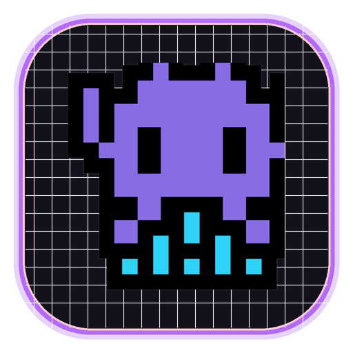
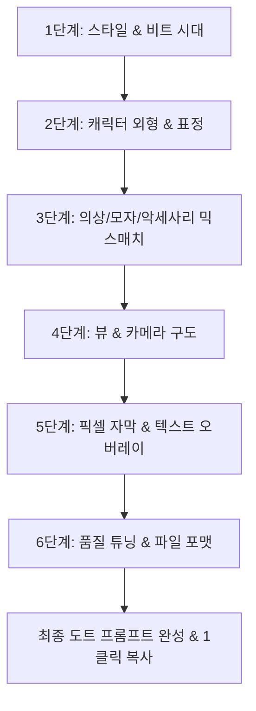
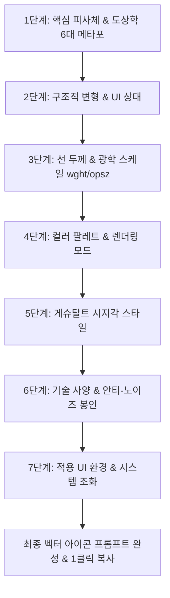

# 👾 GotchaPrompt (갓챠프롬프트)

<div align="center">



### **정밀하게 깎고 다듬어, 한 방에 갓챠! (Gotcha!)**
### **고해상도 레트로 8비트/16비트 도트 그래픽 & 게슈탈트 UI 아이콘 전문 프롬프트 빌더**

[](https://github.com)
[](https://github.com)
[](https://github.com)
[](https://github.com)
[](https://github.com)

</div>

---

## 📖 1. 프로젝트 개요 (Overview)

**GotchaPrompt (갓챠프롬프트)** 는 게임용 도트 아바타, 레트로 캐릭터, 그리고 상용 앱/개발도구 UI 아이콘을 생성형 AI(ChatGPT, Claude, Gemini, Midjourney, Stable Diffusion 등)로 완벽하게 제작할 수 있도록 돕는 **전문 비주얼 프롬프트 스튜디오**입니다.

메인 상단바 하단의 전용 **서브상단바(Sub-header Bar)**를 통해 **[👾 픽셀 스튜디오]**와 **[📐 아이콘 스튜디오]**를 자유롭게 전환하며, 메인 브랜드 타이틀(`GotchaPrompt`)의 일관성을 유지하면서 각 도메인에 특화된 구조화 파이프라인 설계를 통해 원하는 에셋을 한 방에 갓챠(Gotcha!)할 수 있습니다. 특히 아이콘 스튜디오에서는 96/48/24/16px 4대 멀티사이즈 시각 검증과 원클릭 개별 SVG 파일 저장이 가능한 **단독 실행형 `.html` 코드 산출물**을 직접 생성하도록 지원합니다.

---

## ✨ 2. 핵심 기능 및 특징 (Key Features)

### 🚀 1. DirectX 60fps 초경량/초고속 반응성 (WebView2 엔진)
- 기존 데스크톱 GUI 프레임워크(Tkinter 등)에서 발생하던 창 이동 시 버벅임(10fps)과 CPU 렌더링 지연을 완전 해소했습니다.
- Microsoft Edge Chromium WebView2 기반 하드웨어 가속을 통해 부드러운 창 드래그 및 애니메이션 반응 속도를 자랑합니다.

### 📷 2. 첨부 이미지 완벽 참조 & 스마트 언락 (Smart Unlock & Image Reference Mode)
- **2단계(외형/표정), 3단계(의상/소품), 4단계(구도/배경)** 에 **[📷 첨부 이미지 유지 (스킵)]** 옵션이 기본 활성화되어 있습니다.
- **✨ 스마트 언락 인터랙션 (Smart Unlock)**:
  - 유지(스킵) 모드로 딤(Dimmed) 처리되어 있어도 태그 칩 위에 마우스를 올리면 **네온 하이라이트 포커스 효과**가 활성화됩니다.
  - 마음에 드는 태그 칩(아이콘)이나 세트 프리셋을 클릭하는 즉시 **상단의 스킵 체크가 자동으로 해제(언락)되면서 해당 옵션이 바로 선택**되어 불필요한 번거로움을 완전히 없앴습니다.
- 원본 캐릭터 이미지를 AI 챗봇(ChatGPT, Claude, Gemini 등)에 업로드한 상태에서 프롬프트를 전송하면, AI가 기존 캐릭터의 이목구비와 의상을 그대로 보존하면서 픽셀아트화하도록 강력하게 지시합니다.

### 🎽 3. 9대 부위 완전 분리 & 단일 선택화 (Single-select & Conflict Prevention)
- **동일 부위 중복 충돌 방지**: 헤어스타일, 컬러, 눈동자, 눈빛, 표정, 볼터치, 모자, 의상, 소품을 9개 독립 그룹으로 엄격히 분리하여 같은 부위에 상충되는 키워드가 중복 체크되는 현상을 원천 차단했습니다.
- **1클릭 세트 프리셋**: 산타, 한복, 대마법사, 성기사, 스쿨룩, 캐주얼, 사이버, 할로윈 등 완성형 세트를 1클릭으로 적용.
- **재클릭 선택 해제 지원**: 선택된 단일 선택 칩(●)을 다시 클릭하면 선택이 해제(빈 상태)되어, 특정 부위 지정을 원치 않을 때 유연하게 생략할 수 있습니다.

### 🕹️ 4. 정통 레트로 8비트부터 네오지오 32비트까지 3대 스타일 선택
1. **8비트 고전 패미컴 (Famicom / NES Chunky Pixels - 기본값)**:
   - 굵고 투박한 큰 도트 블록, 제한된 4~8색 팔레트, 아케이드 감성의 원초적 픽셀.
2. **16비트 슈퍼패미컴 / 네오지오 (Super Famicom & Arcade)**:
   - 풍부한 16~32색 명암 쉐이딩, 매끄러운 픽셀 테두리, 레트로 명작 RPG 스타일.
3. **모던 인디 하이엔드 픽셀아트**:
   - 디테일한 다크 아웃라인과 세련된 사이버펑크/SF 감성.

### 💬 5. 픽셀 자막 & 텍스트 오버레이 & 지능형 충돌 방지 (Pixel Subtitles & Overlay)
- **원하는 문구 직접 입력**: `자~ 드가자~~`, `GAME OVER`, `STAGE 1` 등 원하는 문구를 자유롭게 입력하면, 레트로 아케이드 폰트로 해당 글자를 박아 넣도록 프롬프트에 자동 결합됩니다.
- **1클릭 빠른 프리셋 칩**:
  - 💀 `GAME OVER` (중앙 + 아케이드 레드)
  - 🕹️ `STAGE 1` (상단 좌측 + 골든 옐로우 HUD)
  - ⭐ `1UP` (상단 우측 + 터미널 그린 스코어)
  - 🪙 `INSERT COIN` (하단 중앙 + 골든 옐로우)
  - 🏆 `MISSION COMPLETE` (중앙 + 골든 옐로우)
- **↔️ ↕️ 가로 / 세로 위치 & 폰트 색상 개별 커스텀**:
  - 세로 위치: 하단 (`Bottom` - 기본값) / 상단 (`Top`) / 중앙 (`Middle`)
  - 가로 위치: 가운데 (`Center` - 기본값) / 왼쪽 (`Left`) / 오른쪽 (`Right`)
  - 폰트 색상: 화이트, 골든 옐로우, 아케이드 레드, 터미널 그린, 네온 시안, 핫 핑크
- **➕ 멀티 텍스트 동시 배치**: `[➕ 새 텍스트/자막 추가]`로 화면 상단과 하단에 각각 다른 텍스트를 무제한 배치 가능.
- **🛡️ 텍스트 제거 옵션 자동 해제 (지능형 충돌 방지)**:
  - 텍스트/자막이 활성화되면 품질 튜닝의 `텍스트/글자 제거` 옵션이 자동으로 언체크 및 비활성화(`disabled`)되며, **`⚠️ 자막 사용 중 자동 해제`** 뱃지가 점등됩니다.
  - 메인 프롬프트의 `no text` 및 전용 부정 프롬프트의 `text, letters, subtitles` 등의 금지어가 완벽히 배제되어 AI가 글자를 누락하거나 뭉개지 않고 선명한 도트 글씨로 렌더링합니다.
  - 자막을 비우거나 비활성화하면 원래의 금지 상태로 스마트 자동 복원됩니다.

### 💾 6. 출력 파일 형식 중복 선택 지원 (.png / .jpg / .svg / .html / .ico)
- 단일 포맷뿐만 아니라 여러 포맷(`.png`, `.svg`, `.html`, `.ico` 등)을 **원하는 조합으로 자유롭게 중복 선택(멀티 토글)** 할 수 있습니다.
- **`.png` (픽셀 기본값)**: 투명 알파 채널 배경 및 무손실 래스터 픽셀 최적화.
- **`.jpg`**: 고대비 단색 배경 및 범용 이미지 포맷.
- **`.svg` (아이콘 기본값)**: 단일 굵은 외곽선과 기하학적 패스를 갖춘 무손실 확장형 벡터 규격.
- **`.html` (아이콘 기본값)**: 96/48/24/16px 4대 멀티사이즈 검증 그리드와 인라인 SVG, 원클릭 `[📥 SVG 다운로드]` 및 `[📦 전체 일괄 다운로드]` 스크립트가 내장된 단독 실행형 웹 뷰어.
- **`.ico`**: 16x16부터 256x256까지 정밀 멀티사이즈 윈도우 앱 아이콘 규격 프롬프트.
- 복수 선택 시 `Target output formats: deliver final assets as .svg, .html files`와 같이 영문 복수형 문장으로 정교하게 자동 조합됩니다.

### 🇰🇷 7. 한국어 답변 강제 고정 (Strictly Korean Output)
- AI 모델이 영문으로 답변을 반환하지 않도록 프롬프트 하단에 한국어 응답 지침을 고정으로 주입합니다:
  > *"Please provide all responses and explanations strictly in Korean (모든 답변과 안내는 반드시 한국어로 작성해 주세요)."*

### 📋 8. 3단계 안전 클립보드 원클릭 복사 시스템
- **1단계**: Windows Native `.NET` API (`System.Windows.Forms.Clipboard.SetText`) 직접 호출.
- **2단계**: 브라우저 레거시 `document.execCommand('copy')` 폴백.
- **3단계**: 모던 비동기 `navigator.clipboard.writeText` 폴백.
- 로컬 파일 샌드박스나 보안 제한 환경에서도 복사 누락 없이 100% 작동합니다.

### 🌗 9. 다크 / 라이트 모드 실시간 슬라이딩 스위치 지원
- 시각적 피로감을 덜어주는 세련된 **다크 테마**와 밝고 깔끔한 가독성을 제공하는 **라이트 테마**를 상단 슬라이딩 토글 스위치(`🌙 [ ○━━ ] ☀️`) 하나로 부드럽게 전환할 수 있습니다.
- 사용자 설정은 `localStorage`에 자동 저장되어 다음 프로그램 구동 시에도 선택한 테마가 유지됩니다.

### 📐 10. 게슈탈트 & 글로벌 OS 디자인 시스템 기반 '아이콘 스튜디오' 추가
- **좌측 정렬 서브상단바**: 메인 상단바 하단에 독립된 전용 서브바를 배치하여 화면 크기와 무관하게 **[👾 픽셀 스튜디오]**와 **[📐 아이콘 스튜디오]**를 원클릭으로 정돈되게 전환합니다.
- **최상단 브랜드 일관성 유지**: 아이콘 스튜디오로 전환하더라도 최상단바의 `GotchaPrompt` 브랜드 타이틀, 6단계 설명, DirectX 60fps 배지는 픽셀 모드 기준으로 변함없이 고정됩니다.
- **각 스튜디오 고유 테마 분리**: 픽셀 스튜디오는 레트로 로즈/에메랄드 아케이드 테마를, 아이콘 스튜디오는 테마 토글 스위치부터 전용 칩/카드까지 모던 벡터 블루/스카이블루 테마로 완벽히 격리 유지합니다.
- **게슈탈트 시지각 원리 반영**: 단순성(Prägnanz), 전경-배경 대비, 완결성(Closure) 지침을 프롬프트에 자동 결합.
- **Apple SF Symbols & Google Material Symbols 규격 호환**: 단색(Monochrome), 계층형 불투명도(Hierarchical), 투톤 팔레트, 시맨틱 멀티컬러 및 opsz(20/24/48dp), wght(100~700) 정밀 스케일링 지원.
- **안티-노이즈 & 안티-더블프레임**: 아이콘 외곽선 안쪽에 생기기 쉬운 연한 테두리선(Inner faint frame) 및 이중 여백을 원천 차단하고 순백색 단색 배경과 단일 패스 벡터 출력을 강제.
- **단독 실행형 HTML & 개별 SVG 다운로더 산출**: AI에게 브라우저에서 바로 열리는 완성형 `.html` 코드로 산출물을 작성하도록 지시하여 4대 멀티사이즈 검증과 개별 SVG 파일 저장을 단 한 번에 끝냅니다.

---

## 🏗️ 3. 6단계 프롬프트 생성 파이프라인

PixelPrompt Studio는 다음과 같은 순서로 정밀한 구조화 프롬프트를 조립합니다:



1. **STYLE & PALETTE**: 선택된 비트 수와 도트 밀도(Chunky 8-bit / Smooth 16-bit), 색상 팔레트 정의.
2. **CHARACTER BASE**:
   - `[📷 첨부 이미지 유지]` 스마트 언락 스킵 모드 지원.
   - **단일 선택(●)**: 캐릭터 기본 유형 11종 (치비 소녀/소년, 냥이/여우 수인, 기사, 마법사, 사이보그, 숲의 엘프, 꼬마 악마, 성스러운 천사, 단검 그림자 닌자🗡️ 등).
   - **9대 세부 부위 분리 및 단일 선택(●)**: 같은 부위 중복 체크로 인해 AI가 원본 캐릭터를 무시하고 엉뚱한 캐릭터를 합성하는 문제를 해결하기 위해, 각 부위를 독립 카테고리로 엄격히 분리 (헤어 스타일 10종, 헤어 컬러 8종, 눈동자 색상 8종, 눈빛/형태 7종, 표정 12종, 볼터치 5종). *선택된 칩을 다시 클릭하면 빈 선택(선택 해제) 가능.*
3. **OUTFIT & PROPS**:
   - `[📷 첨부 이미지 유지]` 스킵 옵션 및 1클릭 프리셋 세트(산타, 한복, 대마법사, 성기사, 스쿨룩 등) 지원.
   - **단일 선택(●)**: 복장 충돌 방지를 위해 모자/헤어 악세사리 11종, 착용 의상 9종, 손에 든 소품 10종을 개별 단일 선택으로 관리하여 단정하고 유니크한 룩 완성.
4. **COMPOSITION & VIEW**:
   - `[📷 첨부 이미지 유지]` 스킵 옵션 지원: **1:1 강제 크롭을 원천 제거**하고 16:9 와이드 영화 씬이나 4:3 짤방 등 원본 비율을 100% 보존하며, 거리 풍경, 건물, 상점 간판, 주변 인물 배경을 온전히 유지.
   - **단일 선택(●)**: 캔버스 종횡비 (📐 원본 비율 유지, 16:9 와이드 시네마틱, 1:1 정사각, 4:3 레트로, 9:16 세로 숏폼).
   - **단일 선택(●)**: 캐릭터 구도 (얼굴 클로즈업, 상반신 바스트업, 전신 미니 스프라이트, 2.5D 아이소메트릭).
   - **단일 선택(●)**: 배경 스타일 (다크 비네팅, 플랫 단색, 파스텔 격자, 네온, 투명 배경).
   - **중복 선택(✓)**: 림라이트 조명, 반딧불 도트 입자, 테두리 액자, 에너지 오라, 대칭 구도 등 연출 효과.
5. **PIXEL SUBTITLE & OVERLAY**:
   - 아케이드 8-bit 블록 도트 타이포그래피 오버레이 지원.
   - 1클릭 프리셋(GAME OVER, STAGE 1, 1UP, INSERT COIN, MISSION COMPLETE) 및 사용자 정의 문구.
   - 세로/가로 위치 및 6종 폰트 색상(화이트, 옐로우, 레드, 그린, 시안, 핑크) 멀티 배치.
   - **자막 중복 방지 (Subtitle De-duplication)**: 원본 짤방에 기존 자막이 있는 경우, 기존 자막을 깔끔하게 지우고 새 도트 자막으로 대체(`seamlessly replace... strictly avoiding duplicate text`)하여 글자가 겹치거나 뭉개지는 현상 원천 차단.
6. **TECHNICAL CONSTRAINT & LOCALIZATION**:
   - **🚫 파이썬/OpenCV 자체 변환 차단 & 네이티브 생성 모델 강제 (Strict Native Model Only)**: 코딩 에이전트나 AI가 `cv2.resize`나 `PIL` 등의 파이썬 다운샘플링 스크립트를 작성하여 조잡하게 이미지를 뭉개는 시도를 원천 차단하고 오직 네이티브 생성형 AI 모델 본연의 도구를 호출하도록 강제.
   - **🛡️ 원본 1:1 엄격 제한 (Anti-Hallucination) 패널**: AI가 원본에 없는 판타지 갑옷, 발광 이펙트, 불필요한 장신구를 멋대로 상상해 덧붙이거나 강제 1:1 왜곡하는 현상을 원천 봉인 (`Strict faithful 1:1 pixel conversion: do not guess, do not hallucinate...`).
   - 체크박스 기반 품질 튜닝: 텍스트 제거(`no text`), 워터마크 제거(`no watermark`), 블러/흐림 방지(`no blur, no anti-aliasing`), 실사/3D 렌더링 배제(`no realistic photograph, no 3d render`)를 메인 프롬프트 및 전용 부정 프롬프트 박스에 실시간 반영.
   - **자막 활성화 시 지능형 충돌 방지**: 자막 사용 시 `텍스트/글자 제거` 자동 해제 및 부정 프롬프트 배제.
   - 요청 파일 포맷 (`.png` 등) 및 한국어 전용 응답 지침 결합.

---

## 📐 4. 아이콘 스튜디오 7대 카테고리 파이프라인 (Icon Studio Pipeline)

게슈탈트 시지각 이론 및 Apple/Google 글로벌 디자인 시스템 규격을 완벽히 준수하는 7단계 구조화 파이프라인입니다:



### 1. 카테고리별 세부 구성
1. **핵심 피사체 및 도상학적 메타포 (Subject & Metaphor)**:
   - 6대 도상학 분류 지원: Navigation(내비게이션), Action(명령/액션), Communication(소통), System(기기/시스템), Weather(날씨/환경), Abstract(기능/추상).
   - 1클릭 공식 예시 A(iOS 탭바 설정), 공식 예시 B(모바일 날씨 위젯), 에디터 6종 세트 등 탑재.
2. **구조적 변형 및 UI 상태 (Structural Variant & State)**:
   - 선형 윤곽선(Outline), 면 채움 솔리드(Solid Fill), 차단/비활성 슬래시(Slashed), 배지 컨테이너(Enclosed Badge), 멀티레이어 중첩(Multi-Layer Stack) 단일 선택(●).
3. **선 두께 및 광학 스케일 (Stroke Weight & Optical Scale)**:
   - 가변 글꼴 축 `wght`(100~200 극세선, 400~500 표준, 700 볼드) 및 `opsz`(20dp 마이크로, 24dp 표준, 48dp 디스플레이) 지원.
4. **컬러 팔레트 및 렌더링 모드 (Color & Rendering Mode)**:
   - 단색 플랫(Monochrome Flat), 계층형 불투명도(Hierarchical Dual-Opacity 100%+35%), 투톤 팔레트(Two-Tone), 시맨틱 다채색(Multicolor), 다크 모드 저굴절 보정(`GRAD -25`).
5. **게슈탈트 시지각 스타일 (Gestalt Visual Perception Style)**:
   - 단순성(Prägnanz), 전경-배경 대비(Figure-Ground), 완결성 컷아웃(Subtractive Closure), 근접성 집단화(Proximity), 시각적 평형(Optical Equilibrium) 복수 선택(✓).
6. **기술 사양 및 안티-노이즈 봉인 (Technical Spec & Anti-Noise)**:
   - **이중 프레임 원천 차단(Anti-Inner-Frame)**: 외곽선 안쪽에 생기기 쉬운 연한 테두리선(Inner faint frame) 및 붕 뜨는 이중 간격 완전 제거.
   - **완성형 HTML/SVG 산출물 강제(Strict HTML Deliverable Mandate)**: 파이썬/OpenCV/PIL 스크립트 생성을 엄격히 차단하고, 96/48/24/16px 멀티사이즈 검증 그리드와 인라인 SVG 및 원클릭 개별/일괄 다운로드 스크립트가 내장된 단독 실행형 `.html` 코드 파일 출력을 강제.
   - 순백색 배경(#ffffff), 그림자/3D/그라데이션 제거, 그리드 정렬 및 중앙 격리.
7. **적용 UI 환경 및 시스템 조화 (Target UI Environment)**:
   - Apple SF Symbols (iOS/macOS HIG), Google Material Symbols v3 (Android/Web), 모던 웹 내비바/사이드바, 고대비 접근성(WCAG AAA).

---

## 📂 5. 프로젝트 폴더 구조 (Directory Structure)

```
PixelPromptStudio/
├── 👾 PixelPromptStudio.exe        # 사전 빌드된 단독 실행 파일 (무설치 포터블)
├── app_webview.py                  # DirectX 60fps WebView2 + .NET 클립보드 런처
├── ui.html                         # 고성능 반응형 UI (HTML5 / Modern CSS / Vanilla JS)
├── create_desktop_shortcut.bat     # 바탕화면 바로가기 원클릭 생성 배치 스크립트
├── build.bat                       # PyInstaller 1클릭 빌드 배치 스크립트
├── requirements.txt                # 필수 파이썬 라이브러리 목록
├── .gitignore                      # Git 버전 관리 제외 설정 파일
├── README.md                       # 프로젝트 소개 및 매뉴얼 문서 (본 문서)
└── assets/                         # 공식 아이콘 및 그래픽 리소스
    ├── app_icon.png                # 512x512 공식 스퀘어클 앱 타일 아이콘
    ├── app_icon_character.png      # 512x512 투명 배경 보라색 픽셀 몬스터
    ├── app_icon.ico                # Windows 다중 해상도 아이콘 (16~256px)
    ├── app_icon.svg                # 무손실 벡터 SVG 아이콘
    └── app_icon_*x*.png            # 규격별 해상도 이미지 (16, 24, 32, 48, 64, 128, 256)
```

---

## 💻 6. 실행 방법 (How to Run)

### 방법 A: 사전 빌드된 실행 파일 사용 (가장 간단한 방법)
1. 바탕화면에 이미 생성된 **`GotchaPrompt`** 👾 바로가기 아이콘을 더블 클릭합니다.
   *(혹은 프로젝트 폴더의 `create_desktop_shortcut.bat`을 더블 클릭하면 언제든 바탕화면에 아이콘 바로가기가 즉시 생성됩니다.)*
2. 또는 `PixelPromptStudio/` 폴더 내의 `PixelPromptStudio.exe`를 직접 실행합니다.
3. 추가 설치나 설정 없이 즉시 하드웨어 가속 60fps 창으로 실행됩니다.

### 방법 B: Python 가상환경에서 실행
```bash
# 1. 의존성 패키지 설치
pip install -r requirements.txt

# 2. 실행
python app_webview.py
```

### 방법 C: 웹 브라우저에서 단독 실행
- 별도의 파이썬 환경이 없더라도 `ui.html` 파일을 Chrome, Edge, Whale 등의 브라우저로 열면 모든 기능을 즉시 사용할 수 있습니다.

---

## 🔨 7. 빌드 및 배포 방법 (Build Instructions)

배포용 `.exe` 단일 실행 파일을 새롭게 빌드하려면:

```bash
# 1-Click 배치 파일 실행
build.bat
```

또는 수동으로 PyInstaller 명령어를 실행합니다:
```bash
python -m PyInstaller ^
  --noconsole ^
  --onefile ^
  --name "PixelPromptStudio" ^
  --icon "assets/app_icon.ico" ^
  --add-data "ui.html;." ^
  --add-data "assets/app_icon.ico;assets" ^
  --add-data "assets/app_icon.png;assets" ^
  --collect-all pywebview ^
  --clean ^
  app_webview.py
```

빌드가 완료되면 `dist/PixelPromptStudio.exe`에 약 18MB의 독립형 단일 실행 바이너리가 생성됩니다.

---

## 💡 8. 생성 팁 (Tips for Best Results)

- **ChatGPT / Claude / Gemini 사용 시**:
  1. 원본 캐릭터 스크린샷이나 참조 이미지를 대화창에 **첨부**합니다.
  2. GotchaPrompt에서 생성된 프롬프트를 **원클릭 복사**하여 붙여넣습니다.
  3. AI가 각 섹션의 지침을 인식하여 캐릭터 개성을 잃지 않는 도트 아바타나 정교한 벡터 UI 아이콘으로 재탄생시킵니다.
- **Midjourney 사용 시**:
  - 픽셀 모드: 프롬프트 뒤에 `--v 6.0 --style raw`를 추가하여 순수 도트 질감 극대화.
  - 아이콘 모드: `--no 3d, realistic, shadow, bevel`을 추가하여 플랫한 벡터 완성도 확보.

---

<div align="center">
  <b>GotchaPrompt</b> · 정밀하게 깎고 다듬어, 한 방에 갓챠! (픽셀 & 아이콘 스튜디오)
</div>
